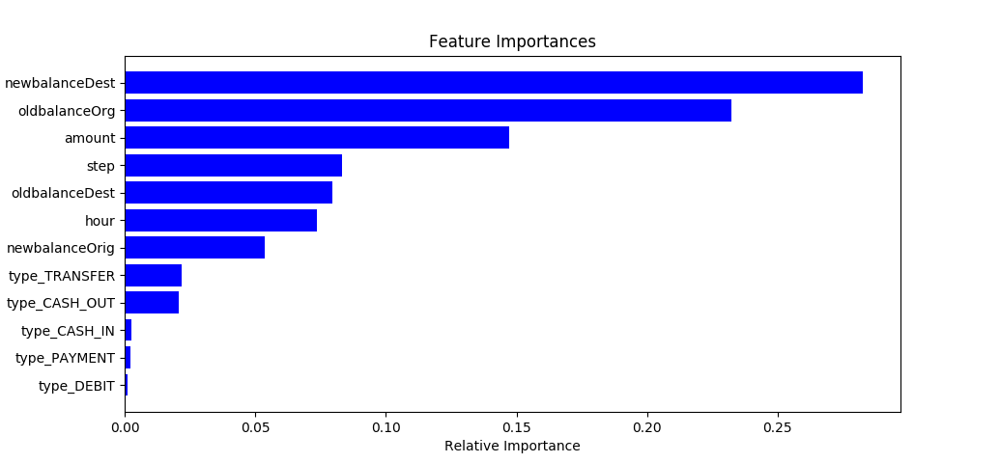

# mobile-money-fraud-detection
Brief analysis of fraud in a synthetic dataset of mobile money transactions


### Requirements ###

- Python 3.6
- Matplotlib
- scikit-learn
- numpy
- pandas

### Install instructions ###

Clone this repo and change into that directory. Run the following command:

```
make
```

This will create a Python virtualenv and attempt to install all the dependencies.

Matplotlib can be a pain to set up on Mac OS. See [here](https://matplotlib.org/faq/osx_framework.html) for some good guidance if you run into any errors.


### Running ###

Run the following from the root of the project:

```
. .venv/bin/activate
```

This will activate the Python virtual environment containing all the needed libraries. If this is successful your command prompt should look similar to the following:

```
(.venv) $
```

Then run the main project:

```
python fraudanalysis.py
```

Details of the analysis will be logged to `model.log`.


***Example plot:***

